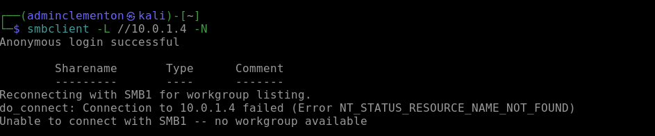
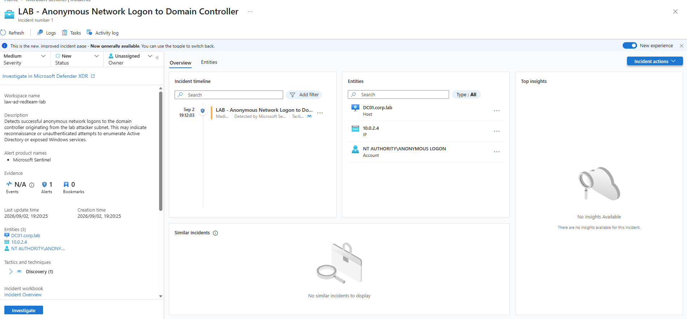
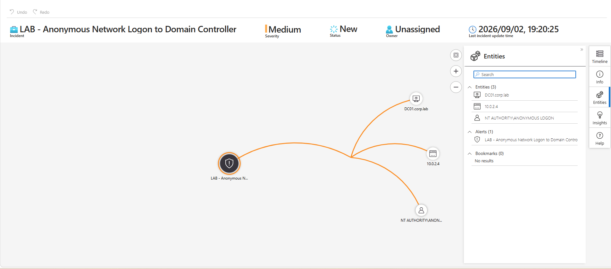
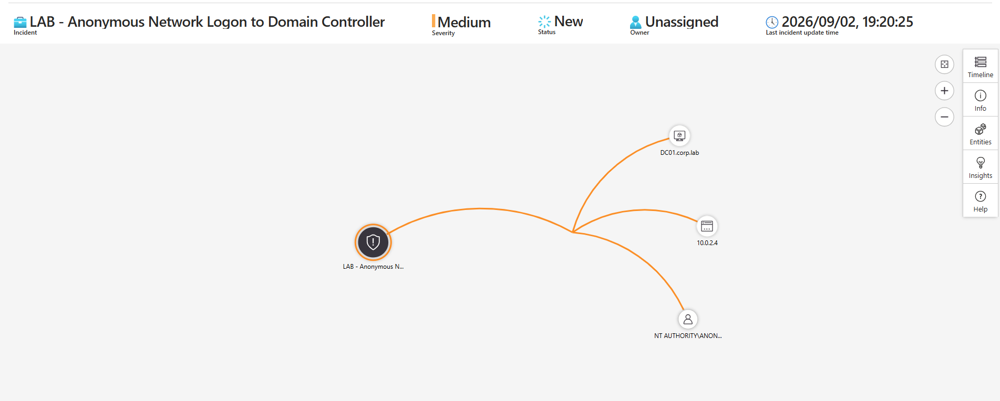

# Scenario 1 - Anonymous Network Logon to Domain Controller

## 1. Scenario Overview

**Scenario Name:** Anonymous Network Logon to Domain Controller  
**Environment:** Azure Active Directory / Active Directory Purple-Team Lab  
**Domain:** `corp.lab`  
**Domain Controller:** `DC01.corp.lab` (`10.0.1.4`)  
**Source / Attacker Host:** `KALI-RED` (`10.0.2.4`)  
**SIEM:** Microsoft Sentinel  
**Telemetry Source:** Windows Security Events collected through Azure Monitor Agent (AMA) and a Data Collection Rule (DCR)  
**Detection Severity:** Medium  
**Primary Windows Event ID:** `4624` - An account was successfully logged on  
**Observed Logon Type:** `3 - Network`  
**Observed Account:** `NT AUTHORITY\ANONYMOUS LOGON`

---

## 2. Objective

The objective of this scenario was to demonstrate how network activity originating from an unexpected host can result in observable authentication telemetry on a domain controller and subsequently be detected by Microsoft Sentinel.

The scenario validates the following purple-team workflow:

```text
Test Activity
    |
    v
KALI-RED (10.0.2.4)
    |
    v
DC01.corp.lab
    |
    v
Windows Security Telemetry
    |
    v
Azure Monitor Agent + DCR
    |
    v
Microsoft Sentinel
    |
    v
KQL Detection
    |
    v
Scheduled Analytics Rule
    |
    v
Alert
    |
    v
Incident
    |
    v
Investigation / Remediation / Retest
```

The detection is intended to identify **successful anonymous network logons to the domain controller from the lab attacker subnet**.

> **Detection caveat:** Event ID 4624 confirms that a logon session was successfully established. It does not, by itself, prove malicious Active Directory enumeration. The security context comes from correlating the anonymous account, network logon type, destination domain controller, source IP/subnet, and the activity that caused the event.

---

## 3. Lab Architecture

| Component | Value |
|---|---|
| Resource Group | `RG-AD-REDTEAM-LAB` |
| Virtual Network | `LAB-VNET` |
| Domain | `corp.lab` |
| Domain Controller | `DC01.corp.lab` |
| DC Private IP | `10.0.1.4` |
| Test Host | `KALI-RED` |
| Test Host IP | `10.0.2.4` |
| SIEM | Microsoft Sentinel |
| Log Collection | Azure Monitor Agent |
| Log Routing | Data Collection Rule |
| Log Table | `SecurityEvent` |

---

## 4. Detection Hypothesis

A device that is not normally expected to perform anonymous network authentication against a domain controller may warrant investigation.

The detection hypothesis for the lab was:

> **If an anonymous network logon is successfully established against the domain controller from the attacker subnet, Microsoft Sentinel should detect the corresponding Windows Security Event and create an incident.**

The signal was based on the combination of:

- Event ID `4624`
- Account `NT AUTHORITY\ANONYMOUS LOGON`
- Logon type `3 - Network`
- Source IP in `10.0.2.0/24`
- Destination `DC01.corp.lab`

---

## 5. Test Activity

### 5.1 Verify SMB Connectivity

From `KALI-RED`, SMB connectivity to the domain controller was checked:

```bash
nmap -Pn -p 445 10.0.1.4
```

The expected result was TCP port `445` being reachable.

### 5.2 Generate the Controlled Anonymous SMB Activity

The following command was used from the isolated lab test host:

```bash
smbclient -L //10.0.1.4 -N
```

The `-N` option instructs `smbclient` not to prompt for a password.

This was a controlled test against the dedicated lab domain controller.

---

## 6. Windows Security Telemetry

The activity produced the following relevant telemetry in Microsoft Sentinel:

```text
EventID:       4624
Activity:      4624 - An account was successfully logged on.
Account:       NT AUTHORITY\ANONYMOUS LOGON
LogonTypeName: 3 - Network
IpAddress:     10.0.2.4
Computer:      DC01.corp.lab
```

### Event Interpretation

**Event ID 4624** represents a successful Windows logon.

**Logon Type 3** represents a network logon. This commonly occurs when a system accesses a resource on another Windows system over the network.

In this scenario, the important detection context was that:

1. The destination was the domain controller.
2. The source was the dedicated attacker/test subnet.
3. The account was `ANONYMOUS LOGON`.
4. The activity was deliberately generated from `KALI-RED`.

---

## 7. Sentinel Investigation Query

The following KQL query was used to investigate the activity:

```kusto
SecurityEvent
| where TimeGenerated > ago(15m)
| where EventID == 4624
| where Account =~ "NT AUTHORITY\\ANONYMOUS LOGON"
| where LogonTypeName has "Network"
| where IpAddress startswith "10.0.2."
| project
    TimeGenerated,
    Computer,
    Account,
    LogonTypeName,
    IpAddress,
    Activity
| order by TimeGenerated desc
```

The query successfully returned matching events from `10.0.2.4` against `DC01.corp.lab`.

---

## 8. Detection Rule

### Rule Name

```text
LAB - Anonymous Network Logon to Domain Controller
```

### Description

```text
Detects successful anonymous network logons to the domain controller
originating from the lab attacker subnet. This may indicate reconnaissance
or unauthenticated attempts to enumerate Active Directory or exposed
Windows services.
```

### Severity

```text
Medium
```

### Detection Query

```kusto
SecurityEvent
| where EventID == 4624
| where Account =~ "NT AUTHORITY\\ANONYMOUS LOGON"
| where LogonTypeName has "Network"
| where IpAddress startswith "10.0.2."
| project
    TimeGenerated,
    Computer,
    Account,
    IpAddress,
    LogonTypeName,
    Activity
```

### Scheduling Used During Lab Validation

```text
Run query every:          5 minutes
Lookup data from last:    5 minutes
Alert threshold:          More than 0 matching results
Create incidents:         Enabled
```

---

## 9. Entity Mapping

The following Sentinel entities were mapped:

| Entity | Sentinel Field |
|---|---|
| Host | `Computer` |
| IP Address | `IpAddress` |
| Account | `Account` |

During validation, Sentinel correctly extracted:

```text
Host:     DC01.corp.lab
IP:       10.0.2.4
Account:  NT AUTHORITY\ANONYMOUS LOGON
```

This allowed the Sentinel investigation graph to associate the source IP, account, destination host, and generated alert.

---

## 10. Detection Validation

After the analytics rule was enabled, the controlled activity was repeated from `KALI-RED`.

Microsoft Sentinel successfully created:

```text
Incident:
LAB - Anonymous Network Logon to Domain Controller

Severity:
Medium

Status:
New

Entities:
DC01.corp.lab
10.0.2.4
NT AUTHORITY\ANONYMOUS LOGON
```

The Sentinel investigation graph also visually associated the alert with the three mapped entities.

### Validation Result

**PASS**

The complete detection pipeline operated successfully:

```text
KALI-RED
    |
    | 10.0.2.4
    v
Anonymous network activity
    |
    v
DC01.corp.lab
    |
    v
Windows Event 4624
Logon Type 3
ANONYMOUS LOGON
    |
    v
Azure Monitor Agent
    |
    v
Data Collection Rule
    |
    v
Microsoft Sentinel
SecurityEvent
    |
    v
Scheduled Analytics Rule
    |
    v
Alert
    |
    v
Incident
```

---

## 11. Investigation Findings

The investigation confirmed:

- The source IP was `10.0.2.4`.
- The destination system was `DC01.corp.lab`.
- The authentication context was `NT AUTHORITY\ANONYMOUS LOGON`.
- Windows recorded Event ID `4624`.
- The logon type was `3 - Network`.
- AMA successfully collected the event.
- The DCR successfully routed the telemetry.
- The event was available in the Sentinel `SecurityEvent` table.
- The custom KQL query matched the activity.
- The scheduled analytics rule generated an alert.
- Sentinel created an incident.
- Host, IP, and account entities were successfully mapped.

---

## 12. MITRE ATT&CK Mapping

### Tactic

**Discovery**

### Technique Considerations

If the underlying activity is specifically used to enumerate domain accounts, it may be documented in the broader attack scenario as:

**T1087.002 - Account Discovery: Domain Account**

However, **Event ID 4624 alone is insufficient to prove Account Discovery**.

The detection therefore focuses on the observable behavior:

```text
Unexpected source
        +
Anonymous network authentication
        +
Domain controller destination
        +
Network logon
```

MITRE technique mapping should be tied to the actual test activity rather than inferred solely from Event ID 4624.

---

## 13. Potential False Positives

Anonymous network logons are not automatically malicious.

Potential legitimate causes can include:

- Windows services using anonymous/null-session behavior.
- Legacy applications.
- Network discovery mechanisms.
- Administrative or monitoring systems.
- Approved vulnerability scanners.
- Expected SMB-related operations.

For this reason, a production detection should establish a baseline and consider:

- Known administrative subnets.
- Approved scanners.
- Expected management servers.
- Known service accounts and systems.
- Destination criticality.
- Frequency and volume.
- Follow-on authentication or discovery activity.

The lab rule intentionally focuses on the `10.0.2.0/24` attacker subnet to reduce noise.

---

## 14. Recommended Remediation

For an unexpected anonymous network logon to a production domain controller:

1. **Validate the source IP.**
   Determine which endpoint owns the address and whether it is expected to communicate with the DC.

2. **Investigate surrounding activity.**
   Search for authentication, SMB, LDAP, Kerberos, process, and discovery telemetry around the same timestamp.

3. **Determine whether anonymous access is required.**
   Review the services responsible for the connection.

4. **Restrict unnecessary network access to domain controllers.**
   Only approved systems and subnets should be able to reach required DC services.

5. **Review SMB and anonymous-access configuration.**
   Disable or restrict unnecessary anonymous functionality where operationally appropriate.

6. **Baseline legitimate behavior.**
   Tune the Sentinel rule by excluding verified management infrastructure rather than suppressing the detection globally.

7. **Escalate suspicious endpoints.**
   If the source is unexpected, investigate it for additional discovery, credential access, or lateral-movement behavior.

---

## 15. Retest Procedure

After remediation or configuration changes:

1. Repeat the controlled lab activity from `KALI-RED`.
2. Verify whether DC01 still records the expected Windows Security telemetry.
3. Query Sentinel for Event ID `4624`.
4. Confirm the source IP and account information.
5. Determine whether the remediation prevents the unwanted behavior.
6. If the behavior remains permitted by design, confirm the analytics rule still generates an alert.
7. Validate entity mapping and incident creation.
8. Record the result as **PASS**, **FAIL**, or **EXPECTED/ACCEPTED** depending on the remediation objective.

---

## 16. Evidence Checklist

The following evidence should be retained with this scenario:

- [ ] Screenshot of connectivity/test activity from `KALI-RED`
 
- [ ] Screenshot of the KQL query results
- [x] Screenshot of generated Sentinel incident

- [x] Screenshot of incident entities

- [x] Screenshot of Sentinel investigation graph

- [x] Screenshot showing matching events associated with the alert


---

## 17. Outcome

Scenario 1 successfully demonstrated an end-to-end purple-team detection workflow in the Azure-hosted Active Directory lab.

The controlled activity originating from `KALI-RED` resulted in Windows Security telemetry on `DC01`, which was collected through AMA and the configured DCR. Microsoft Sentinel successfully queried the event, matched it against the custom detection logic, generated an alert, mapped the relevant entities, and created an incident.

The scenario therefore validated the following project workflow:

```text
Attack / Test
      ↓
Telemetry
      ↓
Collection
      ↓
SIEM
      ↓
Investigation
      ↓
Detection Rule
      ↓
Alert
      ↓
Incident
      ↓
Remediation
      ↓
Retest
```

**Scenario 1 Detection Status: VALIDATED**
